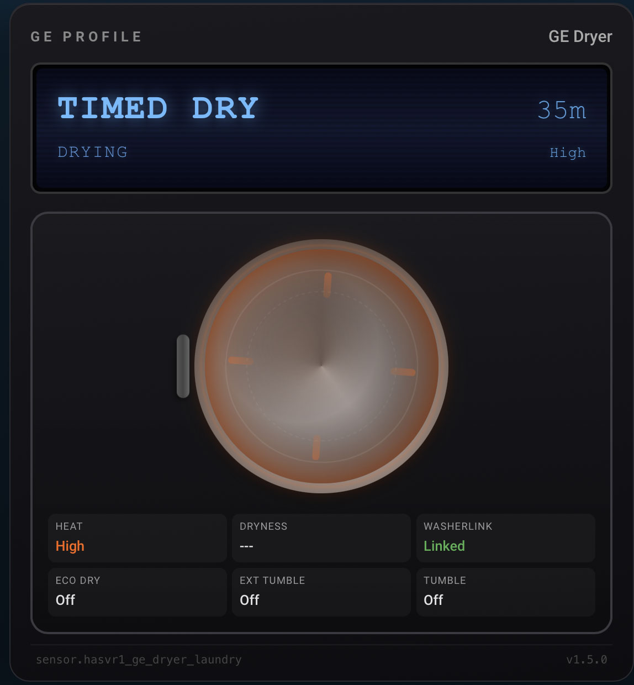
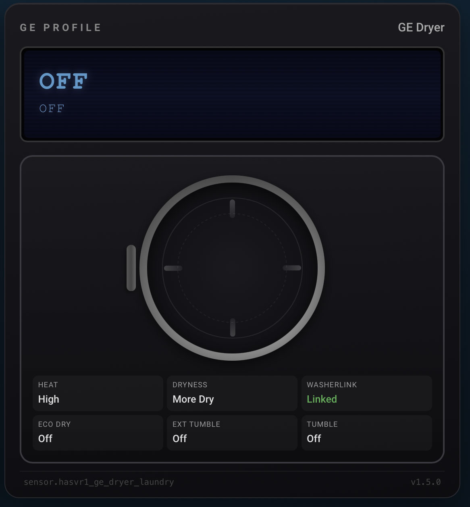

# GE Dryer Card

[](https://hacs.xyz/)
[](https://unlicense.org)

A custom Lovelace card for GE Profile dryers connected via the [SmartHQ integration](https://github.com/simbaja/ha_gehome).





> **Looking for all GE appliance cards in one package?** Check out [GE Appliances Card](https://github.com/ChrisCaho/ge-appliances-card) — a bundle containing washer, dryer, and oven cards.

---

## Features

- Blue LCD display with CRT scanline effect showing cycle, sub-cycle, temperature, and time remaining
- Delay start countdown displayed on the LCD when a delayed cycle is pending
- Front-load dryer drum visualization with door ring, glass window, and handle positioned on the left side to face the paired washer card
- Four radial lifter bars mounted on the drum wall that rotate with the drum while the dryer is active
- Temperature-based color glow applied to the drum glass and sensor values (no heat blue through extra high orange-red)
- Steam wisp animation displayed during steam cycles
- Door open indicator icon shown near the drum when the door is ajar
- Blocked vent fault warning banner — a pulsing red alert prominently displayed above the drum when restricted airflow is detected
- 6-cell sensor grid showing: Heat, Dryness, Sheets (or WasherLink), Eco Dry, Extended Tumble, Steam/Tumble
- WasherLink status cell (shown when `sheets: false`) displays green "Linked" when the washer-dryer communication link is active
- Configurable dryer sheet inventory display — can be replaced with WasherLink status for dryers without a sheet dispenser
- Dark theme styled to match the GE Profile appliance aesthetic

---

## Prerequisites

- Home Assistant with the [SmartHQ integration](https://github.com/simbaja/ha_gehome) configured and your GE dryer connected
- [HACS](https://hacs.xyz/) installed (for the recommended installation method)

---

## Installation

### HACS (Recommended)

1. Open HACS in your Home Assistant sidebar
2. Go to **Frontend** (or **Dashboard** in newer HACS versions)
3. Click the three-dot menu in the top right and select **Custom repositories**
4. Add `https://github.com/ChrisCaho/ge-dryer-card` with category **Lovelace**
5. Search for "GE Dryer Card" and install it
6. Refresh your browser (Ctrl+Shift+R or Cmd+Shift+R on Mac)

### Manual

1. Download `ge-dryer-card.js` from the [latest release](https://github.com/ChrisCaho/ge-dryer-card/releases)
2. Copy it to `/config/www/community/ge-dryer-card/ge-dryer-card.js`
3. Add it as a Lovelace resource in **Settings > Dashboards > Resources**:
   - URL: `/hacsfiles/ge-dryer-card/ge-dryer-card.js`
   - Type: JavaScript Module
4. Refresh your browser

---

## Configuration

Add the card to your Lovelace dashboard using the YAML editor:

```yaml
type: custom:ge-dryer-card
prefix: sensor.hasvr1_ge_dryer_laundry
name: "GE Dryer"
sheets: false
```

### Configuration Options

| Option    | Type    | Required | Default     | Description                                                                 |
|-----------|---------|----------|-------------|-----------------------------------------------------------------------------|
| `prefix`  | string  | yes      | —           | Sensor entity prefix, without the trailing underscore or suffix             |
| `name`    | string  | no       | `GE Dryer`  | Display name shown in the top-right corner of the card                      |
| `sheets`  | boolean | no       | `true`      | When `false`, replaces the Sheets cell with WasherLink status in the grid   |

### Example: Dryer with sheet dispenser (default)

```yaml
type: custom:ge-dryer-card
prefix: sensor.hasvr1_ge_dryer_laundry
name: "GE Dryer"
```

### Example: Dryer without sheet dispenser

```yaml
type: custom:ge-dryer-card
prefix: sensor.hasvr1_ge_dryer_laundry
name: "GE Dryer"
sheets: false
```

---

## Entity Requirements

### How Entity Discovery Works

The card only needs one config value — the `prefix`. It automatically discovers all other entities by appending suffixes to the prefix. **No manual sensor configuration is required.** If a derived entity does not exist, the corresponding field gracefully shows "--" or hides.

The card reads from two HA entity domains using one config value:

- **`sensor.*`** — all cycle, timer, temperature, and feature sensors (prefix + suffix)
- **`binary_sensor.*`** — door, vent fault, and WasherLink states (prefix with `sensor.` swapped to `binary_sensor.` + suffix)

The naming rule: the `prefix` is the portion of the entity ID that is shared by all related entities, up to but not including the first feature-specific suffix. The card appends an underscore and the suffix to build each full entity ID.

**Example:** Given `prefix: sensor.hasvr1_ge_dryer_laundry`, the card builds:

| Domain | Suffix | Full Entity ID | Used For |
|--------|--------|----------------|----------|
| `sensor.` | `_machine_state` | `sensor.hasvr1_ge_dryer_laundry_machine_state` | Machine state (Off, Running, etc.) |
| `sensor.` | `_cycle` | `sensor.hasvr1_ge_dryer_laundry_cycle` | Active cycle name |
| `binary_sensor.` | `_door` | `binary_sensor.hasvr1_ge_dryer_laundry_door` | Door open icon near drum |
| `binary_sensor.` | `_dryer_blocked_vent_fault` | `binary_sensor.hasvr1_ge_dryer_laundry_dryer_blocked_vent_fault` | Vent warning banner |

### Sensors (prefix + suffix)

| Suffix                                    | Description                           |
|-------------------------------------------|---------------------------------------|
| `_machine_state`                          | Machine state (Off, Running, etc.)    |
| `_cycle`                                  | Current cycle name                    |
| `_sub_cycle`                              | Current sub-cycle                     |
| `_time_remaining`                         | Time remaining in seconds             |
| `_delay_time_remaining`                   | Delay start countdown in seconds      |
| `_dryer_temperaturenew_option`            | Heat/temperature level selection      |
| `_dryer_drynessnew_level`                 | Dryness level selection               |
| `_dryer_ecodry_option_selection`          | Eco Dry on/off                        |
| `_dryer_extended_tumble_option_selection` | Extended Tumble on/off                |
| `_dryer_sheet_inventory`                  | Dryer sheet inventory count           |
| `_dryer_sheet_usage_configuration`        | Sheet usage configuration             |
| `_dryer_tumble_status`                    | Tumble status                         |

**Note on tumble_status naming:** SmartHQ uses inconsistent entity naming for some dryer models. The card automatically checks both `ge_dryer_laundry` and `ge_dryerlaundry` variants for the `dryer_tumble_status` entity and uses whichever one exists.

### Binary Sensors (prefix with domain swap + suffix)

The binary sensor entity ID is formed by replacing `sensor.` with `binary_sensor.` in the prefix, then appending the suffix.

| Suffix                      | Description                                                        |
|-----------------------------|--------------------------------------------------------------------|
| `_door`                     | Door open indicator — shown as an icon near the drum               |
| `_dryer_blocked_vent_fault` | Blocked vent fault — triggers the pulsing red warning banner       |
| `_dryer_washerlink_status`  | WasherLink connection — shown in the grid cell when `sheets: false`|

---

## Temperature Color Reference

The drum glow, glass tint, and sensor grid heat value change color based on the active temperature level.

| Temperature Level | Color      |
|-------------------|------------|
| No Heat           | Blue       |
| Air Fluff         | Blue       |
| Extra Low         | Light blue |
| Low               | Teal       |
| Medium Low        | Amber      |
| Medium            | Orange     |
| High              | Deep orange|
| Extra High        | Red-orange |

---

## Pairing with the GE Washer Card

This card is designed to sit next to the [GE Washer Card](https://github.com/ChrisCaho/ge-washer-card). The dryer door handle is positioned on the left side of the drum so that the handles of both cards face each other, mirroring how a stacked or side-by-side washer/dryer pair is oriented in real life.

---

## Bundle Option

If you want the washer, dryer, and oven cards together, install [GE Appliances Card](https://github.com/ChrisCaho/ge-appliances-card) from HACS instead. It includes all three cards in a single package.

---

## Compatibility

- Designed for GE Profile dryers connected via the SmartHQ integration
- Requires Home Assistant 2024.1 or newer
- Works with HACS

---

## License

This project is released into the public domain under [The Unlicense](LICENSE).
